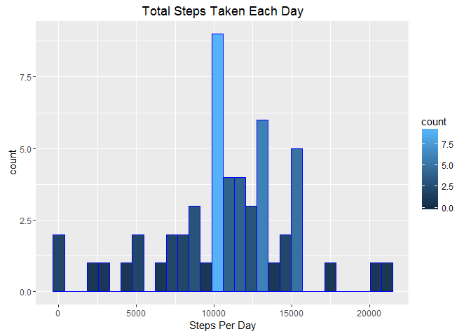
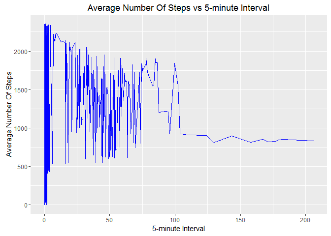
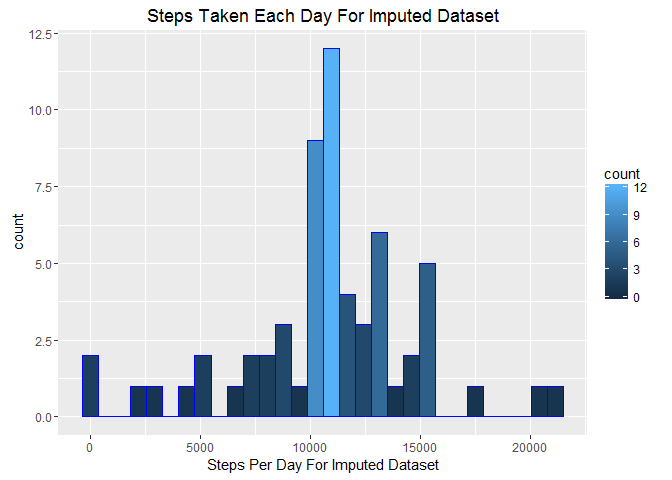
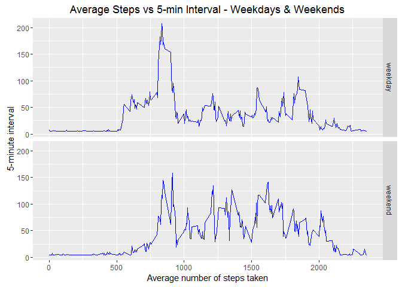

# Reproducible Research: Peer Assessment 1


## Loading required libraries

```r
library(ggplot2)
library(Hmisc)
```

## Loading and preprocessing the data


```r
if(!file.exists("activity.csv"))
     unzip("activity.zip")
activity <- read.csv("activity.csv")
```


## What is mean total number of steps taken per day?

Histogram of the total number of steps taken each day


```r
StepsPerDay <- aggregate(activity$steps,by = list(activity$date),sum)
ggplot(data = StepsPerDay,aes(x)) + geom_histogram(col="blue",aes(fill=..count..)) + xlab("Steps Per Day") + ggtitle("Total Steps Taken Each Day")
```

<!-- -->


Mean and median total number of steps taken per day


```r
StepsPerDayMean <- mean(StepsPerDay$x,na.rm = TRUE)
StepsPerDayMedian <- median(StepsPerDay$x,na.rm = TRUE)
```

* Mean = 1.0766189\times 10^{4}
* Median = 10765

## What is the average daily activity pattern?

Time series plot (i.e. type = "l") of the 5-minute interval (x-axis) and the average number of steps taken, averaged across all days (y-axis)


```r
averageSteps <- aggregate(list(meanSteps=activity$steps),by = list(interval=activity$interval),mean,na.rm=TRUE)
ggplot(averageSteps,aes(meanSteps,interval)) + geom_line(col="blue") + xlab("5-minute Interval") + ylab("Average Number Of Steps") + ggtitle("Average Number Of Steps vs 5-minute Interval")
```

<!-- -->


5-minute interval, on average across all the days in the dataset, containing the maximum number of steps


```r
maxSteps <- averageSteps[averageSteps$meanSteps==max(averageSteps$meanSteps),1]
```

* The 5-minute interval conatining maximum number of steps is 835 when averaged across all the days

## Imputing missing values

Total number of missing values in the dataset


```r
totalNAs <- sum(is.na(activity$steps))
```
* There are 2304 in the original activity dataset

Strategy for filling in all of the missing values in the dataset and creating a new dataset that is equal to the original dataset but with the missing data filled in


```r
imputedActivity <- activity
imputedActivity$steps <- impute(activity$steps, fun=mean)
head(imputedActivity)
```

```
##     steps       date interval
## 1 37.3826 2012-10-01        0
## 2 37.3826 2012-10-01        5
## 3 37.3826 2012-10-01       10
## 4 37.3826 2012-10-01       15
## 5 37.3826 2012-10-01       20
## 6 37.3826 2012-10-01       25
```

Histogram of the total number of steps taken each day for imputed dataset


```r
StepsPerDayImputed <- aggregate(imputedActivity$steps,by = list(imputedActivity$date),sum)
ggplot(data = StepsPerDayImputed,aes(x)) + geom_histogram(col="blue",aes(fill=..count..)) + xlab("Steps Per Day For Imputed Dataset") + ggtitle("Steps Taken Each Day For Imputed Dataset")
```

<!-- -->


Mean and median total number of steps taken per day


```r
StepsPerDayMeanImputed <- mean(StepsPerDayImputed$x)
StepsPerDayMedianImputed <- median(StepsPerDayImputed$x)
```

* The mean of imputed dataset is 1.0766189\times 10^{4} while the median is 1.0766189\times 10^{4}

Difference from the estimates from the first part of the assignment


```r
differenceMean <- StepsPerDayMeanImputed - StepsPerDayMean
differenceMedian <- StepsPerDayMedianImputed - StepsPerDayMedian
```

* Difference between both the mean values is 0
* Difference between both the median values is 1.1886792


## Are there differences in activity patterns between weekdays and weekends?

Creating a new factor variable in the dataset with two levels - "weekday"
and "weekend" indicating whether a given date is a weekday or weekend
day


```r
imputedActivity$daytype <-  ifelse(as.POSIXlt(imputedActivity$date)$wday %in% c(0,6), 'weekend', 'weekday')
```
Panel plot containing a time series plot (i.e. type = "l") of the 5-minute interval (x-axis) and the average number of steps taken, averaged across all weekday days or weekend days (y-axis)


```r
averageImputedActivity <- aggregate(steps ~ interval + daytype, data=imputedActivity, mean)
ggplot(averageImputedActivity,aes(interval,steps)) + geom_line(col="blue") + facet_grid(daytype~.) + xlab("Average number of steps taken") + ylab("5-minute interval") + ggtitle("Average Steps vs 5-min Interval - Weekdays & Weekends")
```

<!-- -->


